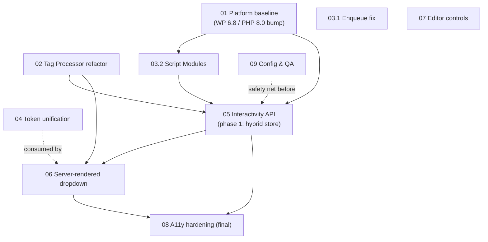

# Planned Updates: Gutenberg Alignment & Interactivity API Migration

This folder contains the modernization plan for Priority Plus Navigation. The goal is to move the plugin from its WP 6.0-era architecture — regex-based HTML rewriting, classic script enqueues, and an imperative vanilla-JS frontend that rebuilds DOM at runtime — to the patterns WordPress core itself now uses, with `core/navigation` in WP 6.9 / Gutenberg 23.x as the reference implementation: `WP_HTML_Tag_Processor` for server-side markup manipulation, the Script Modules API for asset loading, and the Interactivity API for frontend behavior.

## The most important thing to know first

**None of these changes touch saved content.** All `priorityPlus*` attributes live inside the `core/navigation` block's comment delimiters in posts and templates, and everything the plugin adds to the frontend markup is generated at render time by a `render_block` filter. Changing how that output is generated requires **no block deprecations, no migrations, and no changes to existing sites' stored content**. The risk surface is rendered-output parity, not data.

## Documents

| Doc | Title | Priority | Effort | Release | Depends on |
|-----|-------|----------|--------|---------|------------|
| [01](01-platform-baseline.md) | Platform baseline: requirements, metadata, tooling | High | 0.5–1 day | v1.2 (readme fixes) / v2.0 (version bumps) | — |
| [02](02-tag-processor-refactor.md) | Replace regex HTML rewriting with `WP_HTML_Tag_Processor` | High | 2–3 days | v1.2 | — |
| [03](03-enqueue-and-script-modules.md) | Asset loading: enqueue fix + Script Modules migration | High | 2–3 days | Part 1: v1.2 / Part 2: v2.0 | Part 2: 01 |
| [04](04-single-source-design-tokens.md) | Single source of truth for design tokens | Medium | 2 days | v2.0 | — |
| [05](05-interactivity-api-migration.md) | **Interactivity API migration (evaluation + verdict + phases)** | High | 1.5–2 weeks | v2.0 | 01, 02, 03.2 |
| [06](06-server-rendered-dropdown.md) | Server-rendered dropdown (eliminate client DOM building) | High | 1 week | v2.0 | 02, 05; consumes 04 |
| [07](07-editor-controls-modernization.md) | Editor controls modernization | Medium | 2–3 days | v1.2 | — |
| [08](08-accessibility-hardening.md) | Accessibility hardening | Medium-High | 2–3 days | Partial v1.2, final v2.0 | Final form: 05, 06 |
| [09](09-config-extensibility-and-qa.md) | Config surface, extensibility, and QA scaffolding | Low | 2–3 days | v1.2 | — (QA should land before 05/06) |

## Dependency graph

Docs 02, 03.1, 07, and 09 are independent and non-breaking — they can ship anytime. Docs 04, 05, 06, and 08 (final form) are the v2.0 train.

## Release mapping

### v1.2 — non-breaking maintenance release (keeps WP 6.0* support)

- **01** (readme.txt corrections only — headers, "Browse"/"More" fix)
- **02** Tag Processor refactor (output-identical, snapshot-tested)
- **03 part 1** Enqueue registration fix
- **07** Editor controls hygiene
- **09** QA scaffolding (PHPUnit + e2e) — this is the safety net for v2.0

\* Note: the code already calls `wp_trigger_error()` (WP 6.4+) in the bootstrap, so the declared 6.0 minimum is inaccurate today. v1.2 should honestly declare 6.4 unless that call is guarded.

### v2.0 — WP 6.8+ / PHP 8.0+, Interactivity API

- **01** version bumps (Requires at least: 6.8, Requires PHP: 8.0)
- **03 part 2** Script Modules migration
- **04** Token unification
- **05** Interactivity API migration (phased)
- **06** Server-rendered dropdown
- **08** Accessibility hardening (final form)

Sites on WP 6.4–6.7 stay on the 1.x line; readme.txt and the WP.org changelog should state this support policy explicitly.

## Cross-cutting risks

1. **Public contracts to keep byte-stable through v2.0:** the `is-style-priority-plus-navigation` class, the CSS custom property names (`--priority-plus-navigation--*` and `--wp--custom--priority-plus-navigation--dropdown--*`), and the generated dropdown class names styled in `src/styles/style.scss`. These are the de-facto API for theme authors.
2. **`data-*` attribute contract change (v2.0):** `data-more-label`, `data-overlay-menu`, and `data-mobile-collapse` on the `<nav>` are replaced by a single `data-wp-context` in doc 05. Unlikely to have third-party consumers, but list it as breaking in v2.0 release notes.
3. **Core navigation internals dependency:** the plugin detects core's hamburger overlay state by observing undocumented classes (`is-menu-open`, `has-modal-open`). Core's Interactivity store is locked, so there is no supported alternative (see doc 05). Isolate the dependency and re-verify each WP release with the e2e test from doc 09.
4. **Regex → Tag Processor parity:** subtle differences (attribute ordering, entity handling, malformed markup tolerance) are mitigated by the snapshot test matrix in doc 02.

## Relationship to existing docs

`docs/architecture.md`, `docs/how-it-works.md`, and `docs/styling.md` describe the **current** state and remain authoritative until plans land. Each planned-updates doc lists which of those files it obsoletes or amends; updating them is part of each change's definition of done.
